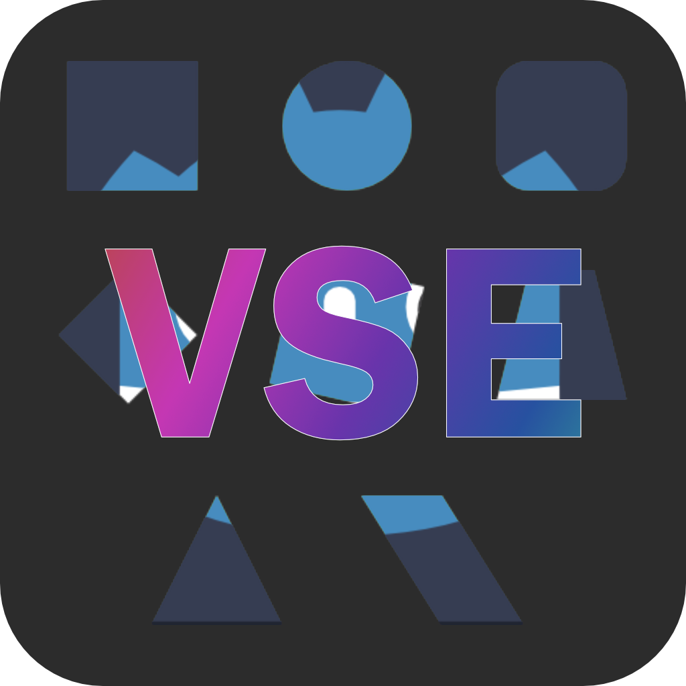
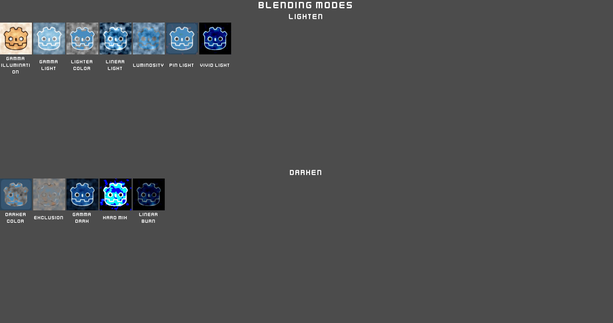
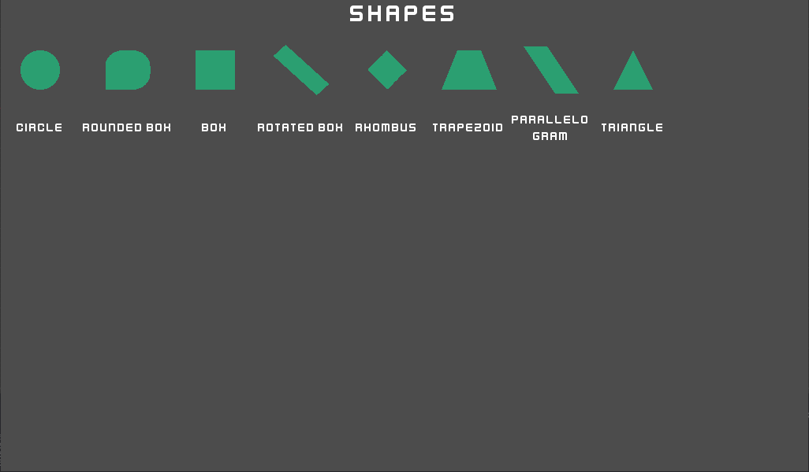
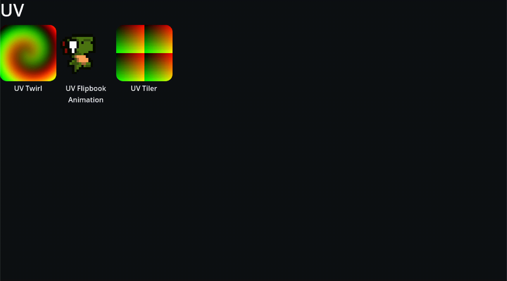

# This is a fork -- please go to the original source: #
https://github.com/paddy-exe/GodotVisualShader-Extras/tree/4.0

  

  
  
  

# GodotVisualShader-Extras 4.0✨

A Visual Shader Node Add-On for the Godot Engine

The icon was kindly supplied by [LucyLavend](https://youtube.com/LucyLavend)

## Provided Nodes
- Blending Modes (taken from Krita Docs and other sources)
	- Darker Colors
	- Exclusion
	- Gamma Dark
	- Gamma Illumination
	- Gamma Light
	- Hard Mix
	- Lighter Color
	- Linear Burn
	- Linear Light
	- Luminosity
	- Pin Light
	- Vivid Light

  

- Shapes (Signed Distance Fields)
	- Box
	- Circle
	- Rounded Box
	- Rotated Box
	- Trapezoid
	- Triangle
	- Rhombus
	- Parallelogram

  

- Usability
	- Compare

- UV
	- UV Twirl
	- UV Flipbook
	- UV Tiler

  

- Wave (click on the links for more detail about the patterns)
	- [Triangle](https://en.wikipedia.org/wiki/Triangle_wave)
	- [Square](https://en.wikipedia.org/wiki/Square_wave)
	- [Sawtooth](https://en.wikipedia.org/wiki/Sawtooth_wave)
	- [Sine (+ Angular Frequency Input variant)](https://en.wikipedia.org/wiki/Sine_wave)

  

## How to get started
To integrate the Visual Shader nodes library into your poject, copy the VisualShaderExtras folder inside your addons folder. If the addons folder doesn't exist yet, create one. There's no further steps or activation through the project settings necessary.

## Why another Visual Shader add-on?
There are already two major Visual Shader add-on solutions. [ShaderV](https://github.com/arkology/ShaderV) is mainly focused on CanvasItem shaders though and [Godot-Visual-Shader-Node-Library](https://github.com/Maujoe/Godot-Visual-Shader-Node-Library) has run stale.

Furthermore, I have plans to work on another add-on (or perhaps a GDExtension) that will utilize the signed distance shapes Shaders for User Interface Design which would make more custom interfaces possible. This idea is heavily inspired by the awesome Unity asset [Shapes by Freya Holmér](https://acegikmo.com/shapes/).

## ℹ️ Contributing
You can contribute by:
* giving feedback
* reporting issues
* creating PRs to solve standing issues
* adding more nodes that you find useful yourself in a PR
* using the library and spreading the word 📰

## 🔢 Versioning
This branch is currently still undergoing changes so you might encounter bugs and breaking changes from the 3.x version.
