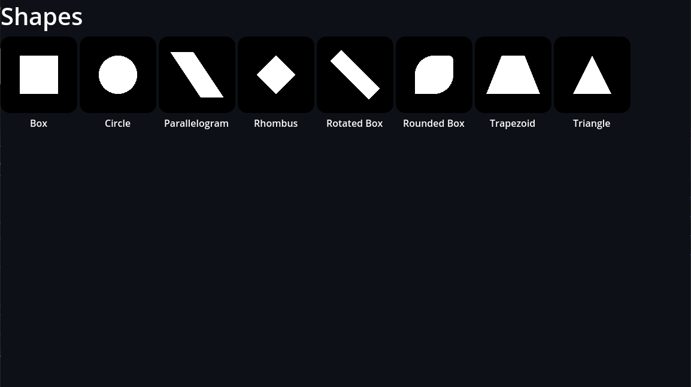

  

  
  
  

# GodotVisualShader-Extras ✨

A Visual Shader Node Add-On for the Godot Engine

## Provided Nodes

  

- Blending Modes (taken from Krita Docs and other sources)
    - Darker Colors
    - Exclusion
    - Gamma Dark
    - Gamma Illumination
    - Gamma Light
    - Hard Mix
    - Lighter Color
    - Linear Burn
    - Linear Light
    - Luminosity
    - Pin Light
    - Vivid Light

  

- Shapes (Signed Distance Fields)
    - Box
    - Circle
    - Rounded Box
    - Rotated Box
    - Trapezoid
    - Triangle
    - Rhombus
    - Parallelogram
    - more coming soon...
- UV
    - UV PolarCoord (CanvasItem and Spatial ShaderMode supported)
    - UV Twirl
    - UV Flipbook
- Utility
    - Random Range
    - Remap
    - Scene Depth

## How to get started
To integrate the Visual Shader nodes library into your poject, copy the VisualShaderExtras folder inside your addons folder. If the addons folder doesn't exist yet, create one. There's no further steps or activation through the project settings necessary.

## Why another Visual Shader add-on?
There are already two major Visual Shader add-on solutions. [ShaderV](https://github.com/arkology/ShaderV) is mainly focused on CanvasItem shaders though and [Godot-Visual-Shader-Node-Library](https://github.com/Maujoe/Godot-Visual-Shader-Node-Library) has run stale.

Furthermore, I have plans to work on another add-on (or perhaps a GDExtension) that will utilize the signed distance shapes Shaders for User Interface Design which would make more custom interfaces possible. This idea is heavily inspired by the awesome Unity asset [Shapes by Freya Holmér](https://acegikmo.com/shapes/).

## ℹ️ Contributing
Contributions of any kind are welcome! Whether it's new nodes, example scenes or an icon for the add-on, all are appreciated. 

## 🔢 Versioning
This add-on is in development for both 3.x and 4.0. There will be a 4.0 branch once I will see that most of the Shapes nodes that are planned are also implemented.
